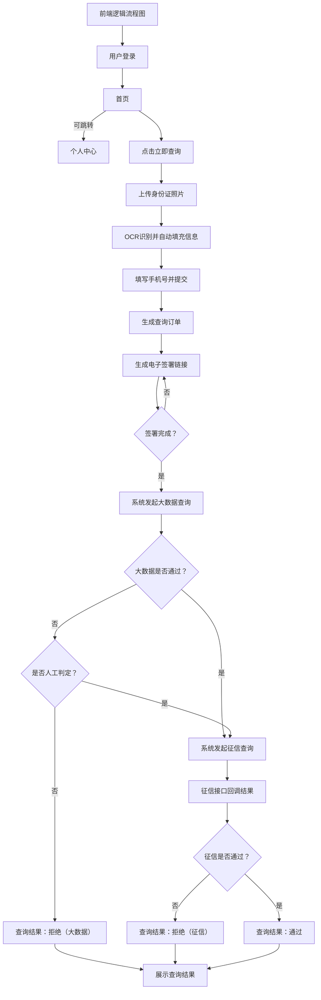

```mermaid  

flowchart TD  
    A[前端逻辑流程图] --> B[用户登录]
    B --> C[首页]
    C -->|可跳转| C1[个人中心]  
    C --> D[点击立即查询]
    D --> E[上传身份证照片]
    E --> F[OCR识别并自动填充信息]
    F --> G[填写手机号并提交]
    G --> H[生成查询订单]
    H --> I[生成电子签署链接]
    I --> J{签署完成？}
    J -- 否 --> I
    J -- 是 --> K[系统发起大数据查询]
    K --> L{大数据是否通过？}
    L -- 是 --> N[系统发起征信查询]
    
    %% 大数据不通过，增加人工判断节点
    L -- 否 --> L1{是否人工判定？}
    L1 -- 否 --> M[查询结果：拒绝（大数据）]
    L1 -- 是 --> N
    
    N --> O[征信接口回调结果]
    O --> P{征信是否通过？}
    P -- 否 --> Q[查询结果：拒绝（征信）]
    P -- 是 --> R[查询结果：通过]
    
    %% 汇总显示结果
    M --> Z[展示查询结果]
    Q --> Z  
    R --> Z  

```